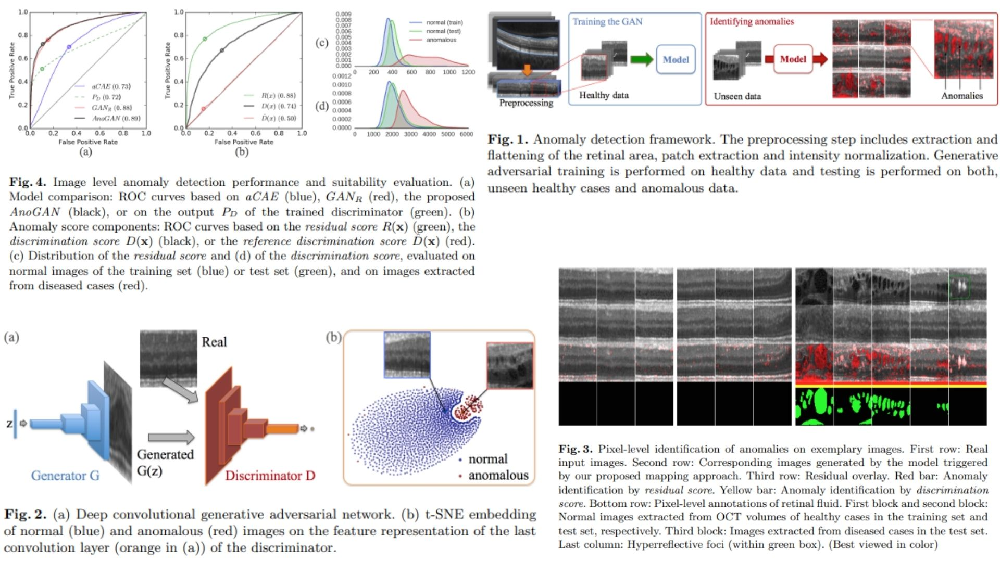

# 🌀 AnoGAN-Replication — Unsupervised Anomaly Detection with GANs

This repository provides a **faithful Python replication** of the **AnoGAN framework** for unsupervised anomaly detection.  
It implements the pipeline described in the original paper, including **generator-discriminator training, residual reconstruction, and anomaly scoring**.

Paper reference: *[AnoGAN: Deep Anomaly Detection Using Generative Adversarial Networks](https://arxiv.org/abs/1703.05921)*  

---

## Overview ✨



> The pipeline trains a **DCGAN** on normal images, generates **synthetic reconstructions**, and produces **pixel-wise anomaly scores** by comparing the original and generated images.

Key points:

* **Generator** $$G(z)$$ maps latent vectors $$z \sim \mathcal{N}(0,1)$$ to synthetic images $$\hat{x}$$  
* **Discriminator** $$D(x)$$ outputs probability of realness for input $$x$$  
* **Residual comparison**: $$R = |x - \hat{x}|$$ captures pixel-level anomalies  
* **Anomaly score** combines residual and feature differences: $$A = (1-\lambda)\|x - \hat{x}\|_1 + \lambda \|D_l(x) - D_l(\hat{x})\|_1$$  

---

## Core Math 📐

**Generator mapping**:

$$
\hat{x} = G(z)
$$

**Discriminator probability**:

$$
D(x) \in [0,1]
$$

**Residual loss**:

$$
\mathcal{L}_{res} = \| x - \hat{x} \|_1
$$

**Feature loss (optional)**:

$$
\mathcal{L}_{feat} = \| D_l(x) - D_l(\hat{x}) \|_1
$$

**Total loss for anomaly scoring**:

$$
\mathcal{L}_{ano} = (1-\lambda) \mathcal{L}_{res} + \lambda \mathcal{L}_{feat}
$$

**Anomaly detection mapping**:

Iteratively optimize $$z$$ to minimize $$L_\text{ano}$$ for a given query image $$x_\text{query}$$.

Final anomaly map: $$R = \left|x_\text{query} - G(z^*)\right|$$


---

## Why AnoGAN Matters 🌿

* Detects anomalies **without anomalous training data** 🧩  
* Provides **pixel-level anomaly maps** suitable for defect localization or segmentation  
* Combines **residual and feature-level differences** for robust scoring  

---

## Repository Structure 🏗️

```bash
AnoGAN-Replication/
├── src/
│   ├── generator/
│   │   ├── g_dcgan.py                # DCGAN generator: z → x_hat
│   │   └── g_forward.py              # Forward pass (ConvTranspose + activation)
│   │
│   ├── discriminator/
│   │   ├── d_dcgan.py                # DCGAN discriminator: x → probability
│   │   └── d_forward.py              # Forward pass (Conv layers)
│   │
│   ├── layers/
│   │   └── conv_blocks.py            # DCGAN conv/deconv blocks
│   │
│   ├── loss/
│   │   └── anogan_loss.py            # Residual + feature loss
│   │
│   ├── model/
│   │   └── anogan_model.py           # Full pipeline: G + D + anomaly mapping
│   │
│   └── config.py                     # λ, latent_dim, lr, betas, batch_size, epochs, device
│
├── images/
│   └── figmix.jpg                     
│
├── requirements.txt
└── README.md
```

---

## 🔗 Feedback

For questions or feedback, contact:  
[barkin.adiguzel@gmail.com](mailto:barkin.adiguzel@gmail.com)
